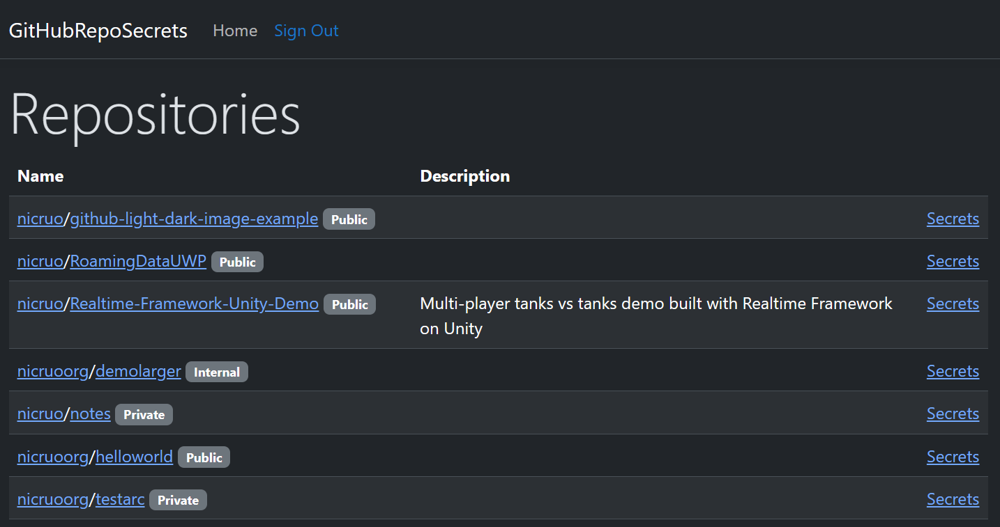
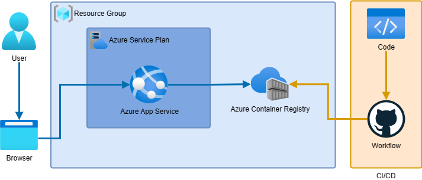

# GitHubRepoSecrets

## Description

GitHubRepoSecrets is a project that aims to help developers to manage their GitHub repository secrets. Access repository secrets that you are a writer, even without admin rights.



## Installation

1. Create a GitHub OAuth App and save the client ID and client secret.

2. Docker

```bash
cd src
docker build -t githubreposecrets .
docker run -p 8080:8080 -p 8081:8081 -e GITHUB__CLIENTID='YOUR_CLIENTID' -e GITHUB__CLIENTSECRET='YOUR_CLIENTSECRET' githubreposecrets                              
```


3. Alternatively, you can run the project locally.

```bash
cd src
dotnet run --project src/GitHubRepoSecrets.csproj
```

## Website in Azure

[GitHubRepoSecrets](https://githubreposecretsapp.azurewebsites.net/)

## Cloud Architecture

<picture>
  <source media="(prefers-color-scheme: dark)" srcset="./images/cloud_architecture_dark.drawio.png">
  
</picture>